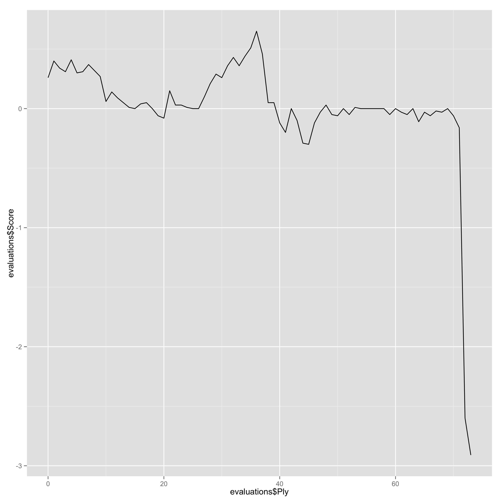

Large-scale Analysis of Chess Games
===================

5 millions of chess games (300+ million of chess positions) have been recorded from the very beginning of chess history to the last tournaments of Magnus Carlsen. 
It's time to analyse all of them! 

This repository contains different resources (e.g., Java code) to analyse chess games. *Current status*:
 * We are writing a technical report on various statistics of the chessgame database (e.g., number of unique positions);
 * We are using [Igrida Cluster](http://igrida.gforge.inria.fr/) for large computations with Stockfish UCI Engine
 
**Do not hesitate to participate or contact us!**

#### Objectives

We hope to gather various interesting insights on the skills, ratings, or styles of (famous) chess players. 
In fact numerous applications can be and have been considered such as cheat detection, computation of an intrinsic, "universal" rating, or the determination of key moments chess players blunder. For instance we would like to answer a question like "Who are the best chess players in history?"

For doing so, you typically need to analyze millions of moves with chess engines; it requires lots of computations. 
Our goal is to propose an open infrastructure for **large-scale analysis of chess games**. 
Specifically, we aim to:
 * replicate state-of-the-art research results (e.g., on cheat detection or intrinsic ratings); 
 * provide open data and procedures for exploring new directions;
 * investigate software engineering/scalability issues when computing millions of moves; 
 * organize a community of potential contributors for fun and profit.
 
#### Static analysis 

We are essentially analysing headers information (related to players' ratings, dates, openings, etc.). 
We qualify the analysis as "static" (as opposed to "dynamic", see below) since we do not analyse moves with chess engines.
Until now we have:
 * parsed various PGN files and structure each game in a (relational) database
 * processed games with [Spark SQL](https://spark.apache.org/sql/) in order to generate CSV files together with [R](http://www.r-project.org/) scripts to compute statistics 

*We are writing a technical report on various statistics of the database (e.g., number of unique positions)*

Chess games are saved in PGN file, for example
```
[Event "FIDE Candidates 2014"]
[Site "Khanty-Mansiysk RUS"]
[Date "2014.03.25"]
[Round "10.1"]
[White "Karjakin,Sergey"]
[Black "Andreikin,D"]
[Result "1/2-1/2"]
[WhiteTitle "GM"]
[BlackTitle "GM"]
[WhiteElo "2766"]
[BlackElo "2709"]
[ECO "B46"]
[Opening "Sicilian"]
[Variation "Taimanov variation"]

1. e4 c5 2. Nf3 e6 3. d4 cxd4 4. Nxd4 Nc6 5. Nc3 a6 6. Nxc6 bxc6 7. Qd3 Qc7 8. Qg3 Qxg3 9. hxg3 d5 10. g4 Rb8 11. g5 f6 12. gxf6 Nxf6 13. e5 Nd7 14. f4 Nc5 15. Rh3 a5 16. b3 Ba6 17. Bxa6 Nxa6 18. Na4 Rb4 19. Bd2 Re4+ 20. Kf1 Bb4 21. c3 Ba3
22. Re1 Rxe1+ 23. Kxe1 O-O 24. Ke2 h6 25. Rg3 Kf7 26. Rh3 Kg6 27. Rg3+ Kf7 28. Rh3 Kg6 29. Rg3+ Kf7 1/2-1/2
```

As you can notice, each PGN file is separated in two parts: (1) headers (2) moves

The static analysis first parses each file and inspects each interesting headers information like *White Elo Rating*, *Result* or *Date*. We can also get an iterator on moves to get information about *Pieces Captured Count* or *Pieces Moves Count*...
We parse all games with a [Java parser](http://sourceforge.net/projects/pgnparse/) in order to analyze different moves (promotions, king castling, captured pieces...) and generate FENs.

#### Dynamic analysis 

We will analyse all generated [FEN](https://en.wikipedia.org/wiki/Forsyth%E2%80%93Edwards_Notation) on [Igrida Cluster](http://igrida.gforge.inria.fr/) with [Stockfish](https://stockfishchess.org/) UCI Engine (e.g., depth 20 with multi-pv 1). All logs are saved in files and afterwards in a (relational) database.

```
rnbqkbnr/pppppppp/8/8/8/5N2/PPPPPPPP/RNBQKB1R b KQkq - 1 1
info depth 1 seldepth 1 multipv 1 score cp 783 nodes 47 nps 47000 time 1 pv e4b4.
info depth 2 seldepth 2 multipv 1 score cp 807 nodes 119 nps 119000 time 1 pv e4b4 e6e7 b4b2 c2c1.
info depth 3 seldepth 4 multipv 1 score cp 813 nodes 213 nps 106500 time 2 pv e4b4 e6e7 b4b2 c2c1 f4d3 c1d1.
info depth 4 seldepth 6 multipv 1 score cp 813 nodes 351 nps 175500 time 2 pv e4b4 e6e7 b4b2 c2c1 f4d3 c1d1.
info depth 5 seldepth 7 multipv 1 score cp 905 nodes 711 nps 355500 time 2 pv e4b4 e6e7 b4b2 c2c1 f4d3 c1d1 a3a2.
info depth 6 seldepth 9 multipv 1 score cp 1056 nodes 2120 nps 706666 time 3 pv e4b4 e6e7 b4b2 c2c3 f4d5 c3d3 d5e7 h4h5.
...
```

For instance, Stockfish can calculate a score and evaluation of each move:

| Ply | Move | White | Black | Score | Eval  | Comment | 
|-----|------|-------|-------|-------|-------|---------| 
| 0   | [1]  | e4    |       | 0.26  | 0.26  |         | 
| 1   | [1]  |       | c6    | 0.4   | -0.14 |         | 
| 2   | [2]  | d4    |       | 0.34  | -0.06 |         | 
| 3   | [2]  |       | d5    | 0.31  | 0.03  |         | 
| 4   | [3]  | Nc3   |       | 0.41  | 0.1   |         | 
| 5   | [3]  |       | dxe4  | 0.3   | 0.11  |         | 
| 6   | [4]  | Nxe4  |       | 0.31  | 0.01  |         | 
| 7   | [4]  |       | Bf5   | 0.37  | -0.06 |         | 
| 8   | [5]  | Ng3   |       | 0.32  | -0.05 |         | 
| ...   | ...  | ...  | ...   | ...  | ...  |         | 
| 69  | [35] |       | Ne5   | 0.0   | -0.03 |         | 
| 70  | [36] | Kd2   |       | -0.06 | -0.06 |         | 
| 71  | [36] |       | Nd7   | -0.16 | 0.1   |         | 
| 72  | [37] | Ke3   |       | -2.6  | -2.44 | Erreur  | 
| 73  | [37] |       | c5    | -2.91 | 0.31  |         | 

We can easily generates the evolution score of the game, in fact :




### Key numbers

Because it's not possible to make a lot of reservation on Igrida, I run 3 sort of jobs : 
- Small job during the day (9h-17h)
- Medium job during the night (17h-5h)
- Long job during the week and week-end

| Name       | Number of jobs | Duration | Number of FEN to analyse per job | Total of FEN to analyse | Total worktime |
|------------|----------------|----------|----------------------------------|-------------------------|----------------|
| Short Job  | 10 000         | 8h       | 6 000                            | 60 000 000              | 80 000h        |
| Medium Job | 9 000          | 12h      | 10 000                           | 90 000 000              | 108 000h       |
| Long Job   | 4 000          | 64h      | 30 000                           | 120 000 000             | 256 000h       |
| Total      | 23 000         | -        |                                  | 270 000 000             | 444 000h       |

We can see that it takes **444k hours to analyse our 270 millions FEN**. To give you an idea, that represents 18 500 days (50 years) on a unique machine.

Our 270 millions FEN takes only 15.5 Go memory before analysis. Yet, each analysis has 3 ko logs (~3000 characters per log). So, we expect about **800 Go logs**.

In average, Stockfish calculates 7 millions combinaisons at depth 20. So, we can think Igrida has, at total, calculates more than 2e15 nodes (~2 000 000 000 000 000).

#### Contact 

This project is part of a research internship at Inria/IRISA laboratory [DiverSE team](http://diverse.irisa.fr) on chess analysis:
 * François Esnault (MSc Student, University of Rennes 1) is the main developer and contributor of the project. 
 * Mathieu Acher (Associate Professor, University of Rennes 1) is supervising the project. 

